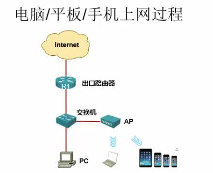

# CCNA

CCNA CCNP CCIE

Cisco Certified Network Associate 思科认证网络工程师

具备安装、配置、运行中型路由和交换网络，并进行故障排除的能力

网络技术分类

- 路由交换
- 运营商
- 安全
- 协作（语音）
- 无线
- 数据中心,虚拟化Vmware

All But Cisco （ABC）思科最难配

网络建设

- 售前环节：售前工程师，现场考察设计方案包括网络拓扑结构和设备选型
- 售后环节：项目经理、技术支持工程师、技术实施工程师
- 维护环节：网管、代维（代理维护）

网络行业生态链

- 设备厂商：锐捷、华为、思科
- 代理商、集成商
- 用户：移动、电信等运营商

CCNA学习大纲

- 网络基础（网络模型和子网划分）
- 路由
- 交换（难点）
- 路由的高级功能
- 广域网（局域网的远程互联）
- IPv6和无线

目前是IPv4由于NAT（网络地址转换）可以实现地址大量节约，一个公网IP对应很多子网IP。IPv6在物联网时代一定会应用，是全公网时代，并且很安全。

200人一下小网络

OSI 7层模型

- 应用层
- 表示层
- 会话层
- 传输层
- 网络层
- 数据链路层
- 物理层

TCP/IP 4层模型

- 应用层
- 传输层
- 因特网层
- 网络接入层

思科组网3层模型

- 接入层
- 汇聚层
- 核心层

思科模拟器介绍

- GNS3
Graphical Network Simulator图形化网络模拟器
版本：GNS3 v0.8.6 all-in-one，不可以安装中文目录下
www.gns3.net
- Cisco Packet Tracer

- Web IOU

思科网络设备的模拟：硬件+软件，模拟器相当于硬件，下载的思科操作系统（IOS,互联网操作系统）相当于软件

Cisco3640 为当前硬件